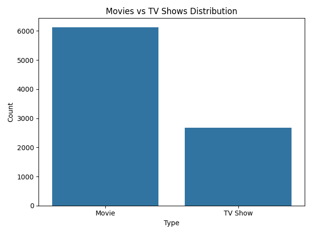
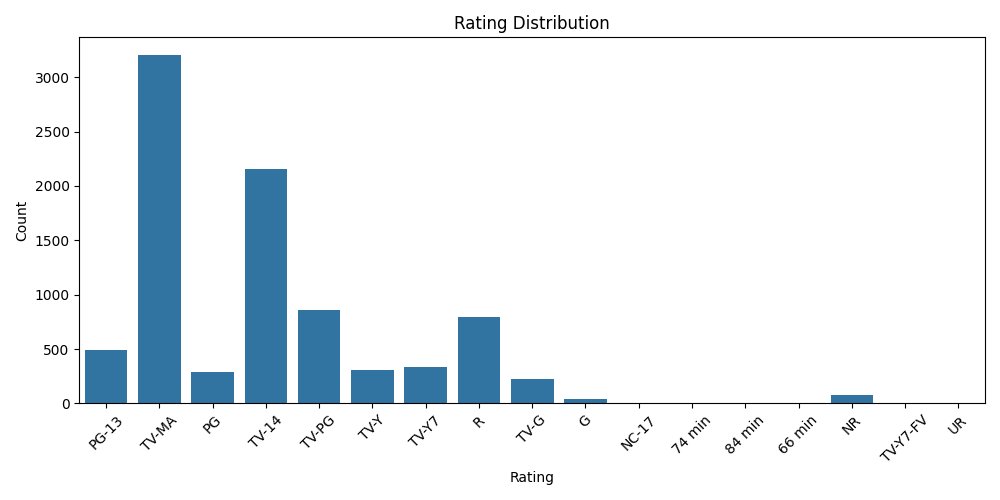
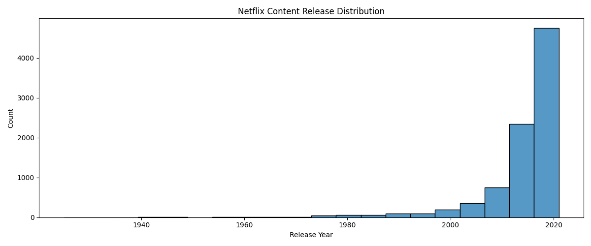
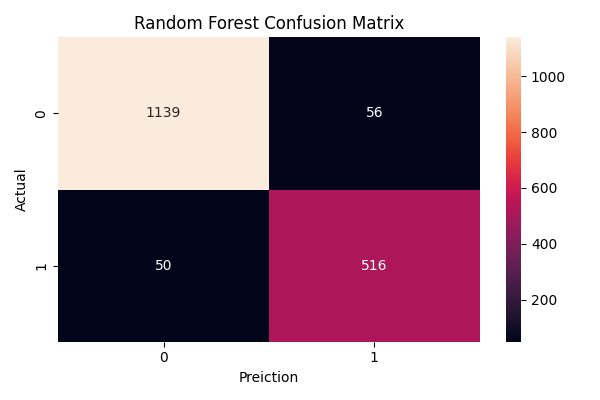

# Netflix Content Classification Using Machine Learning

## Overview

This project analyzes the Netflix Titles dataset and builds machine learning models to classify content as either a **Movie** or a **TV Show**.

The project covers the complete machine learning workflow, including data cleaning, exploratory data analysis (EDA), feature engineering, model training, and performance evaluation.

---

## Key Results

* **Best Model:** Random Forest Classifier
* **Highest Accuracy:** 93.98%
* **Features Used:** Rating, Release Year, Director
* **Dataset:** Netflix Movies and TV Shows Dataset
* **Models Compared:** Decision Tree, Random Forest, Logistic Regression

---

## Dataset

The Netflix Movies and TV Shows dataset contains information such as:

* Title
* Director
* Cast
* Country
* Release Year
* Rating
* Genre (`listed_in`)
* Content Type (Movie / TV Show)

---

## Project Workflow

### 1. Data Cleaning

* Identified missing values in the dataset
* Handled missing values in:

  * Director
  * Country
  * Cast
* Removed rows with missing values in machine learning features

### 2. Exploratory Data Analysis (EDA)

Performed analysis and visualization of:

* Movies vs TV Shows distribution
* Rating distribution
* Release year distribution
* Top Netflix genres

Libraries used:

* Pandas
* Matplotlib
* Seaborn

### 3. Feature Engineering

Selected and transformed features including:

* Rating
* Release Year
* Director

Applied **Label Encoding** to convert categorical variables into numerical values suitable for machine learning models.

### 4. Model Training

Trained and compared:

* Logistic Regression
* Decision Tree Classifier
* Random Forest Classifier

### 5. Model Evaluation

Evaluated models using:

* Accuracy Score
* Confusion Matrix

---

## Results

### Experiment 1

**Features Used**

* Rating
* Release Year

| Model               | Accuracy |
| ------------------- | -------: |
| Decision Tree       |   70.98% |
| Random Forest       |   70.53% |
| Logistic Regression |   68.82% |

### Experiment 2

**Features Used**

* Rating
* Release Year
* Director

| Model               |   Accuracy |
| ------------------- | ---------: |
| Decision Tree       |     93.02% |
| Random Forest       | **93.98%** |
| Logistic Regression |     86.66% |

### Experiment 3 (Genre-Based Feature Engineering)

**Features Used**

* Rating
* Release Year
* Main Genre

| Model               | Accuracy |
| ------------------- | -------: |
| Decision Tree       |   99.89% |
| Random Forest       |   99.49% |
| Logistic Regression |   71.32% |

#### Analysis

Initially, genre information appeared to dramatically improve model performance, producing near-perfect classification accuracy.

Further investigation revealed that many genre categories were strongly associated with a single target class. For example:

* Genres such as *Crime TV Shows*, *International TV Shows*, and *Kids' TV* were almost exclusively TV Shows.
* Genres such as *Comedies*, *Dramas*, and *Documentaries* were almost exclusively Movies.

As a result, genre acted as a near-direct proxy for the target variable (Movie vs TV Show), making the classification task significantly easier.

This experiment highlights the importance of feature analysis and demonstrates how highly correlated features can produce misleadingly high performance metrics.

### Observation

Adding **director information** significantly improved classification performance, indicating a strong relationship between directors and content type.

Genre information was also tested as a feature. It produced near-perfect accuracy because genre labels were highly correlated with the target variable (Movie vs TV Show), making classification almost trivial.

---

## Technologies Used

* Python
* Pandas
* NumPy
* Matplotlib
* Seaborn
* Scikit-learn

---

## Project Structure

```text
Netflix_ML_Project/
│
├── netflix_titles.csv
├── eda.py
├── train_model.py
├── README.md
└── screenshots/
```

---

## How to Run

### 1. Clone the Repository

```bash
git clone <repository-url>
```

### 2. Install Dependencies

```bash
pip install pandas numpy matplotlib seaborn scikit-learn
```

### 3. Run Exploratory Data Analysis

```bash
python eda.py
```

### 4. Run Machine Learning Models

```bash
python train_model.py
```

---

## Project Visualizations

### Movies vs TV Shows Distribution



### Rating Distribution



### Release Year Distribution



### Top Netflix Genres


### Random Forest Confusion Matrix



---

## Conclusion

This project demonstrates a complete machine learning workflow, including data cleaning, exploratory data analysis, feature engineering, model training, and evaluation.

Among the tested models, the **Random Forest Classifier** achieved the highest accuracy of **93.98%**. Feature engineering experiments showed that director information significantly improved model performance, while genre information acted as a near-direct proxy for the target variable and produced near-perfect classification results.

---

## Future Improvements

* Use additional metadata features
* Perform advanced feature engineering
* Explore recommendation systems
* Handle high-cardinality features more effectively
* Deploy the model as a web application
